# Code::Blocks Dark

One command puts a dark theme into Code::Blocks on Windows. Pick from eleven
themes with a live preview in the terminal, and it backs your config up first.

```
  Code::Blocks Dark    up/down move   Enter install   Esc cancel

  > Dracula                  ###  +-------------------------------+
    Espresso Libre           ###  | #include <stdio.h>            |
    KFT2                     ###  |                               |
    Modnokai Coffee          ###  | // dark mode, finally         |
    Modnokai Night Shift     ###  | int main() {                  |
    Modnokai Night Shift v2  ###  |     printf("hello");          |
    Oblivion                 ###  |     return 0;                 |
    Solarized Dark           ###  | }                             |
    Son of Obsidian          ###  +-------------------------------+
    Sublime                  ###
    Vim                      ###
```

Each card is drawn in the theme's own colours, read live from its `.conf`.

## Read this first

**Stock Code::Blocks can only go dark in the editor.** The code area themes
perfectly. The menus, toolbars, Management and Logs panels stay light grey, and
no theme file can change that: Code::Blocks 25.03 is built against wxWidgets
3.2, whose Win32 controls have no dark mode at all. Dark mode arrived in
wxWidgets 3.3 and will not be in a stable release until 3.4.0, and the
Code::Blocks developers [decided in 2024](https://forums.codeblocks.org/index.php?topic=25899.0)
to wait for it.

If you want dark menus and panels too, see [Full dark UI](#full-dark-ui) below.
It is a real option with a real catch.

## Install

**One command** (PowerShell, nothing to download by hand):

```powershell
irm https://raw.githubusercontent.com/teterw/codeblocks-dark/main/install.ps1 | iex
```

**Or the zip**, if you would rather click than paste: download it from
[Releases](https://github.com/teterw/codeblocks-dark/releases), unzip anywhere,
and double-click **`install.bat`**.

Either way you get the same picker. Close Code::Blocks first — it rewrites its
config when it exits and would undo the change.

Non-interactive, if you already know what you want:

```powershell
.\install.ps1 -Theme dracula        # skip the picker
.\install.ps1 -List                 # print the theme slugs
.\install.ps1 -NoPreview            # plain numbered menu
```

## Themes

| | |
|---|---|
| **Dracula** <br> 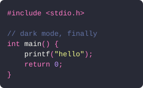 | **Solarized Dark** <br> 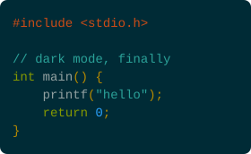 |
| **Modnokai Night Shift** <br> 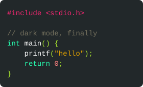 | **Son of Obsidian** <br> 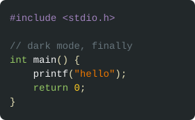 |
| **Sublime** <br> 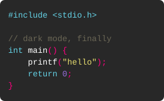 | **Oblivion** <br> 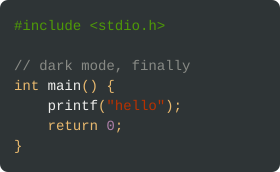 |
| **Modnokai Coffee** <br> 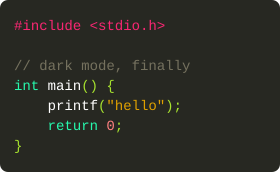 | **Espresso Libre** <br> 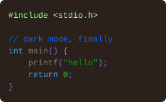 |
| **Modnokai Night Shift v2** <br> 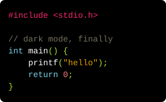 | **KFT2** <br> 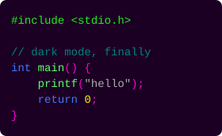 |
| **Vim** <br> 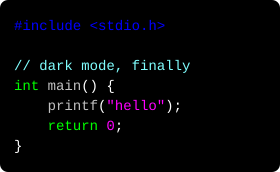 | |

These previews are generated from the same `.conf` files the installer reads, so
they cannot drift from what you actually get.

## What it touches

- Reads and writes `%APPDATA%\CodeBlocks\default.conf` — the theme goes into
  `<editor><colour_sets>`, exactly where Code::Blocks keeps its own.
- Copies that file to `default.conf.bak-<timestamp>` before changing anything.
- Refuses to run while `codeblocks.exe` is open.
- Nothing else. No registry, no admin rights, no machine execution-policy
  change (`install.bat` uses `-ExecutionPolicy Bypass`, which is per-process).

Installing a second theme keeps the first, so you can switch later from
**Settings > Editor > Syntax highlighting > Colour theme** without rerunning
anything.

## Uninstall

```powershell
.\uninstall.ps1          # lists your backups, restores the one you pick
.\uninstall.ps1 -Latest  # restore the newest, no questions
```

## Full dark UI

The whole window can be dark, but only via
[adbrt/codeblocks-dark-mode-msw](https://github.com/adbrt/codeblocks-dark-mode-msw):
an experimental build of Code::Blocks against a pre-release wxWidgets 3.3, which
has the `MSWEnableDarkMode()` call that makes Win32 controls dark.

Be clear about what that is before handing it to anyone:

- A **single release from 26 November 2023** — older than Code::Blocks 25.03.
- Unsigned, built by one person, with no updates since.
- Ships no compiler, so it relies on finding a toolchain already on the machine.

If that is an acceptable trade, `install.ps1` will fetch it, **verify it against
a pinned SHA-256**, unpack it to `%LOCALAPPDATA%\CodeBlocksDark`, apply your
chosen theme to its own portable config, and put a shortcut on the desktop. Your
real Code::Blocks install is never touched by this path; the two sit side by
side.

```powershell
.\install.ps1 -Mode portable    # just the full-dark build
.\install.ps1 -Mode both        # theme the real install too
```

## Verified

`test\Test-Install.ps1` runs 21 checks against `test/real-default.conf`, a
genuine Code::Blocks-written config with its comment header, CDATA sections and
tab indentation intact. They cover the splice (install, replace, switch, missing
`colour_sets`, non-Code::Blocks input), the file format (no BOM, CDATA, comment
and unrelated sections preserved, no temp file left behind), byte-for-byte
backup and restore, and the preview renderer.

```powershell
powershell -ExecutionPolicy Bypass -File test\Test-Install.ps1
```

Tests prove the XML matches what Code::Blocks writes; they cannot prove
Code::Blocks agrees. `tools\Verify-EndToEnd.ps1` does that: it runs a real
Code::Blocks in portable mode against a themed config, lets it load and rewrite
that config, and checks the theme survived. Against Code::Blocks 25.03 it does —
the config comes back rewritten by Code::Blocks itself, all 42 styles intact and
still active.

```powershell
powershell -ExecutionPolicy Bypass -File tools\Verify-EndToEnd.ps1 -CodeBlocksDir C:\path\to\codeblocks
```

## Development

```powershell
python tools/split-themes.py <pack.conf> ...   # rebuild themes/ from upstream packs
python tools/make-svg-previews.py              # rebuild the README previews
powershell -File tools\Show-Previews.ps1       # eyeball every picker frame
```

`split-themes.py` keeps only dark themes that define a comment colour distinct
from plain text. The upstream `dark_gray` sets no comment colour at all, so its
comments would render identically to code; it is dropped for that reason.

Each `themes/*.conf` is still a valid Code::Blocks theme file, so it can be
imported by hand through `cb_share_config.exe` if you never want to run a
script.

## Credits

Themes come from [yzhong52/CodeBlocksThemes](https://github.com/yzhong52/CodeBlocksThemes)
and [Dracula](https://github.com/dracula/codeblocks). The full-dark build is
[adbrt/codeblocks-dark-mode-msw](https://github.com/adbrt/codeblocks-dark-mode-msw).
This repo packages their work; the themes belong to their authors.

MIT licensed.
